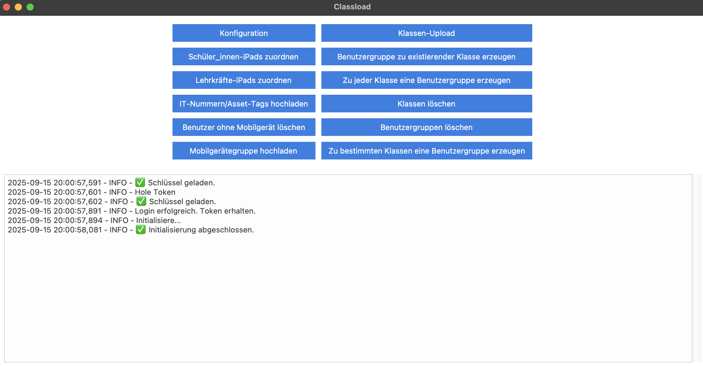

# 👩‍🏫 Classload – Schul-iPad-Verwaltung mit JAMF, iServ & Webuntis

> *Automated iPad management for schools using JAMF, with support for iServ and Webuntis where needed*

**Classload** hilft bei der Verwaltung von Mobilgeräten, Benutzern, Benutzergruppen und vor allem Klassen mit JAMF.

So schön kann Jamf (mit Classload) organisiert sein: 

- Die Mobilgerätenamen beinhalten die Klarnamen der Nutzer:innen, so dass bei Airdrops direkt klar ist, wer welche Datei versendet hat.
- Der Asset-Tag (in Dortmund die IT-Nummer) ist bei allen Geräten eingetragen, so dass Geräte in JAMF leicht gefunden werden können.
- Allen Lehrer- und Schüler-Geräten sind Benutzer mit Klarnamen zugeordnet. In der Classroom-App sieht dadurch dann später alles schön übersichtlich aus.
- **Zu jedem Unterricht in Webuntis gibt es eine Gruppe in iServ und zu jeder Gruppe in iServ gibt es eine entsprechende Classroom-Klasse und bei Bedarf auch eine statische Mobilgeräte-Gruppe. Classload ermöglicht letzteres, wenn sowohl Webuntis als auch iServ verwendet werden und Unterrichte mit dem Webuntis Connector synchronisieren.**
- (Bluetooth ändern ist deaktiviert, damit Schüler:innen sich der Classroom-App weniger leicht entziehen können).

## 📦 Download

Aktuelle Versionen von Classload:

- 🪟 [Windows (64-bit)](https://github.com/chribdo/classload/releases/download/v0.9.0/classload-0.9.0-win64.exe)
- 🍎 [macOS](https://github.com/chribdo/classload/releases/download/v0.9.0/classload-0.9.0-macOS.app.zip)

Ein ungetesteter Linux-Build ist auf der [Release-Seite](https://github.com/chribdo/classload/releases) zu finden.

## 💻 Voraussetzungen

* JAMF-Account mit API-Zugriff (Standard bei JAMF-Accounts).
* Eine Statische Benutzergruppe für alle Lehrkräfte muss in JAMF existieren.
* Für den Klassen-Upload müssen JAMF und iServ bereits Kursdaten austauschen wie [hier](https://help.untis.at/hc/de/articles/4411822372754-Plattform-Applikation-IServ) und [dort](https://doku.iserv.de/manage/user/webuntis/) beschrieben.

## 🖼️ Screenshot

## ✨ Funktionen und Hilfe

Das Programm startet nach dem Lizenzdialog mit der Eingabe von Benutzername und Passwort sowie der Adresse der (eigenen) JAMF-Instanz. Danach stehen Schaltflächen mit folgenden Funktionen zur Verfügung:

* **Konfiguration**: Hier werden Werte eingetragen, mit denen das Programm arbeitet.
    * Statische Benutzergruppe aller Lehrkräfte in JAMF: In JAMF sollte eine (statische) Benutzergruppe angelegt werden, der (zum aktuellen Zeitpunkt oder später) alle Benutzer angehören, die Lehrkräfte sind. Der Name dieser Gruppe **muss hier eingetragen werden**. Alle anderen Wertänderungen sind optional und sollten im Zweifelsfall nicht vorgenommen werden.
    * SITE-ID: Die SITE-ID wird automatisch aus dem Account ermittelt. Eine JAMF-Instanz kann mehrere Sites haben (z.B. für mehrere Schulen).
    * Ausgabepfade: Es gibt automatische Vorschläge, die bei Bedarf geändert werden können. In diese Verzeichnisse werden Dateien geschrieben, die zur Kontrolle vor dem eigentlichen Klassen-Upload genutzt werden können.
    * Mögliches Postfix für JAMF-Schüler-Benutzer: Schüler können bei Bedarf ein Postfix erhalten, also statt 'Betty Beispiel' z.B. 'Betty Beispiel RSG'. Das führende Leerzeichen sollte, falls gewünscht, nicht vergessen werden. Standardmäßig wird dieses Postfix nicht verwendet, auch wenn es eingetragen ist. Das Mapping funktioniert aber auch damit.
    * Lehrkräfte-POSTFIX: Um Lehrerbenutzer in JAMF schnell erkennen zu können, erhalten diese standardmäßig ein Postfix. Bei uns am RSG wird z.B. aus 'Betty Beispiel' 'Betty Beispiel RSGL'.
* **Schüler:innen-iPads zuordnen**: Als Eingabe wird eine csv mit drei Spalten benötigt: Vorname; Nachname; Seriennummer. Als Trennzeichen wird ein Semikolon erwartet, Spaltenüberschriften soll es nicht geben, bei der Seriennummer ist es egal, ob ein S davor steht oder nicht. In Dortmund kann man diese Daten einfach aus der Excel-Tabelle, die man ohnehin für die Verträge führt, kopieren und aus Excel oder ähnlichen Programmen als csv exportieren. Nach dem Auslesen der Datei werden die Geräte automatisch umbenannt und erhalten einen Benutzer mit passendem Namen.
* **Lehrkräfte-iPads zuordnen**: Als Eingabe wird eine csv-Datei mit vier Spalten benötigt: Vorname; Nachname; Lehrerkürzel (eindeutig); Seriennummer. Als Trennzeichen wird ein Semikolon erwartet, Spaltenüberschriften soll es nicht geben, bei der Seriennummer ist es egal, ob ein S davor steht oder nicht. Nach Auswahl der Datei werden die Geräte automatisch umbenannt und erhalten einen Benutzer mit passendem Namen. Das Lehrerkürzel wird bei der Telefonnummer eingetragen (sic!). Außerdem werden die Lehrkräfte der Benutzergruppe der Lehrkräfte hinzugefügt.
* **IT-Nummern/Asset-Tags hochladen**: Als Eingabe wird eine csv mit zwei Spalten benötigt: Asset-Tag (=IT-Nummer); Seriennummer. Als Trennzeichen wird ein Semikolon erwartet, Spaltenüberschriften soll es nicht geben, bei der Seriennummer ist egal, ob ein S davor steht oder nicht. Nach diesem Prozess können iPads über den Asset-Tag bzw. die IT-Nummer in JAMF gefunden werden.
* **Benutzer ohne Mobilgerät löschen**: Alle Benutzer ohne Mobilgerät, die keine Lehrkräfte sind, werden gelöscht. Das kann praktisch sein, wenn z.B. Benutzer alter Jahrgänge gelöscht werden sollen, die ihre Leih-iPads bereits zurückgegeben haben.
* **Klassen-Upload**: Das Herzstück von Classload. 
    * Zu jeder Schüler-Gruppe in iServ wird eine entsprechende Classroom-Klasse erzeugt. Wenn Webuntis und iServ Daten austauschen, wird also zu jedem Webuntis-Unterricht eine entsprechende Classroom-Klasse erzeugt. Schüler:innen und Lehrkräfte können automatisch übernommen werden. Mehr zur Verbindung von iServ und Webuntis [hier](https://help.untis.at/hc/de/articles/4411822372754-Plattform-Applikation-IServ) oder [hier](https://doku.iserv.de/manage/user/webuntis/). 
    * Für den Klassen-Upload geht man wie folgt vor: Zuerst gibt man ein Präfix für die neu zu erstellenden Klassen ein und prüft, ob die Lehrkräfte-Benutzergruppe richtig eingetragen ist. Als Präfix kann man z.B. das aktuelle Datum wählen oder einfach so etwas wie "a_". Das Präfix dient nur dazu, veraltete Klassen später mit einem Klick wieder löschen zu können und sie vom Upload neuerer Klassen zu unterscheiden. 
    * Dann wird man aufgefordert, eine csv-Datei mit iServ-Schülerdaten auszuwählen. Diese kann man im iServ-Verwaltungsbereich unter Benutzer herunterladen. Dazu wählt man bei Rollen einfach Schüler aus, klickt auf filtern und dann auf exportieren. Zuvor sollte man unter iServ->Verwaltung->Benutzer->WebUntis->WebUntis Unterrichte nach IServ importieren dafür gesorgt haben, dass die Daten zu den Unterrichten aktuell sind. Diese Daten werden in der csv-Datei mit exportiert und von Classload nach Auswahl der gespeicherten Datei weiterverarbeitet. 
    * Classload arbeitet eine Weile und dann kann man bestätigen, dass der Klassenupload beginnen kann. Vorher kann man, wenn man möchte, die Klassenstruktur und die zusammengeführten Schülerdaten überprüfen. Vor dem eigentlichen Upload werden die Daten in zwei Dateien geschrieben. Die Pfade zu diesen Dateien können unter Konfiguration eingesehen oder geändert werden. Die Zuordnung der Lehrkräfte zu den Klassen erfolgt über die Lehrer-Kürzel im Namen des Unterrichts bzw. der Classroom-Klasse. Wichtig ist also, dass die Kürzel bei den JAMF-Lehrkräfte-Benutzern mitverwaltet werden und bei der Telefonnummer (sic!) eingetragen sind.
    * Nach Abschluss des Vorgangs kann man die neuen Klassen in JAMF sehen und nutzen.
* **Benutzergruppe zu existierender Klasse anlegen**: Wenn man den Namen einer bereits existierenden Klasse eingibt, wird dazu eine statische Benutzergruppe mit denselben Schülern erzeugt. Dieser Gruppe kann man dann in JAMF besondere Rechte oder Apps zuweisen. Klassen selbst kann man leider keine Apps o.ä. zuweisen.
* **Zu jeder Klasse eine Benutzergruppe erzeugen**: Zu allen bereits existierenden Klassen der Schule (bzw. der Site) wird jeweils eine statische Benutzergruppe angelegt. Dieser Prozess dauert leider extrem lange. Eine Laufzeit von z.B. einer Nacht muss nicht unbedingt ausreichen.
* **Klassen löschen**: Löscht alle Klassen der Schule (bzw. der Site), die ein bestimmtes Präfix haben. Wenn z.B. "0525_" als Präfix eingegeben wird, werden genau die Klassen gelöscht, deren Name mit "0525_" beginnt.
* **Gruppen löschen**: Löscht alle statischen Benutzergruppen der Schule (bzw. der Site), die ein bestimmtes Präfix haben. Wenn als Präfix z.B. "0525_" eingegeben wird, werden genau die Benutzergruppen gelöscht, deren Name mit "0525_" beginnt.

## 📘 Dokumentation

👉 [https://chribdo.github.io/classload/](https://chribdo.github.io/classload/tk_main_menue.html)

## 🧑‍💻 Autorin

Classload wurde entwickelt von Dr. Christiane Borchel, Lehrerin am Reinoldus- und Schiller-Gymnasium in Dortmund. Kontakt: classload[at]gmx-topmail.de.

## ✨ Dank
Ich bedanke mich bei der Gruppe der Administrierenden an Dortmunder Gymnasien für den Erfahrungsaustausch, insbesondere bei Manuel Laurenz, unserem lokalen Pionier in Sachen JAMF-API. Natürlich wäre das Projekt ohne Chat-GPT für mich nebenberuflich kaum zu machen gewesen.

## 📄 Lizenz

Die Nutzung ist ausschließlich für den privaten und schulischen Bereich gestattet.  
Die kommerzielle Nutzung oder die Nutzung durch Schulträger ist nur im Rahmen einer Testversion erlaubt. Genaueres ist in der Datei [LICENSE.txt](LICENSE.txt) geregelt.

## 🌐 Website

- 🔗 [Classload-Website](https://chribdo.github.io/classload/) – Die offizielle Projektseite.